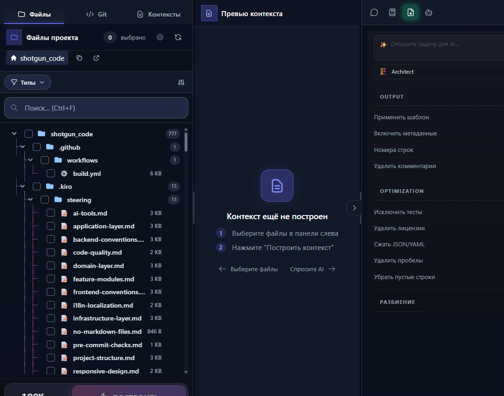
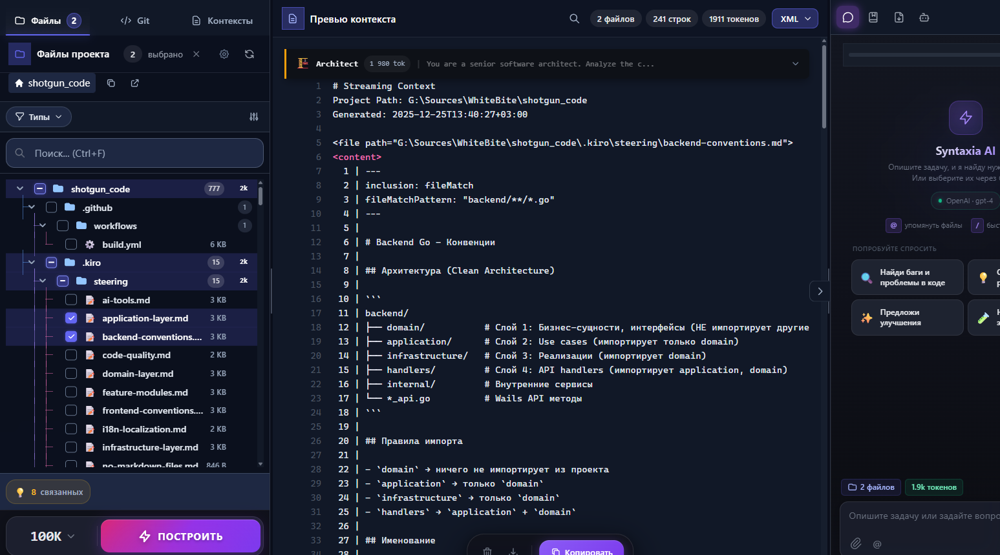
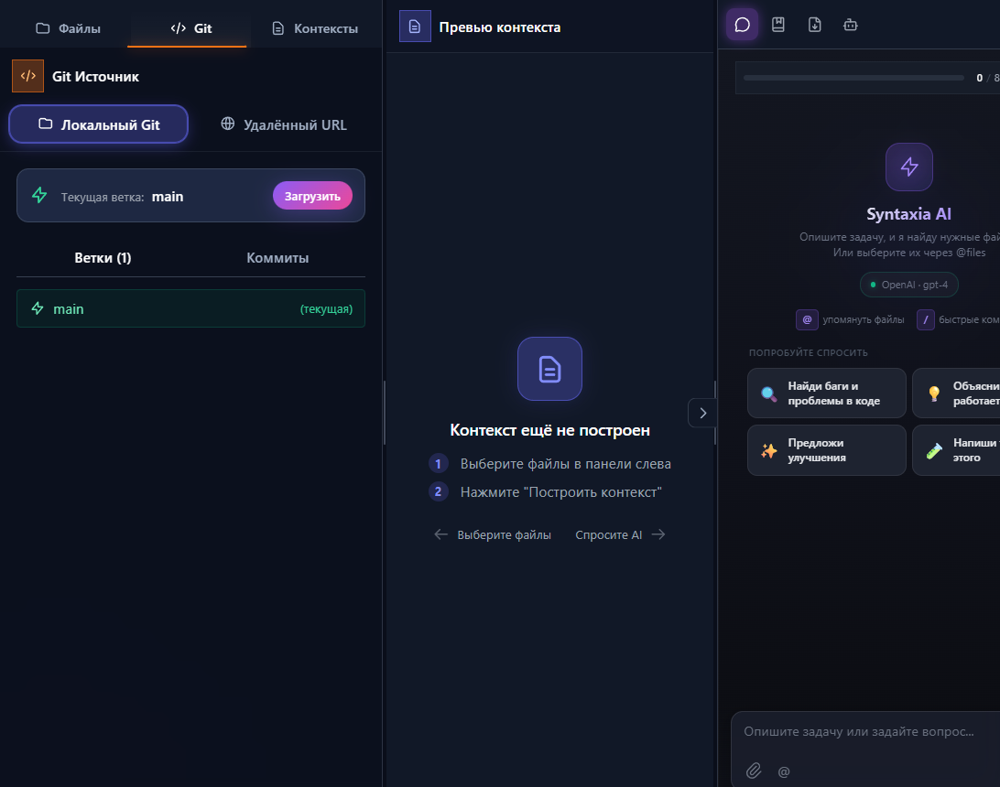
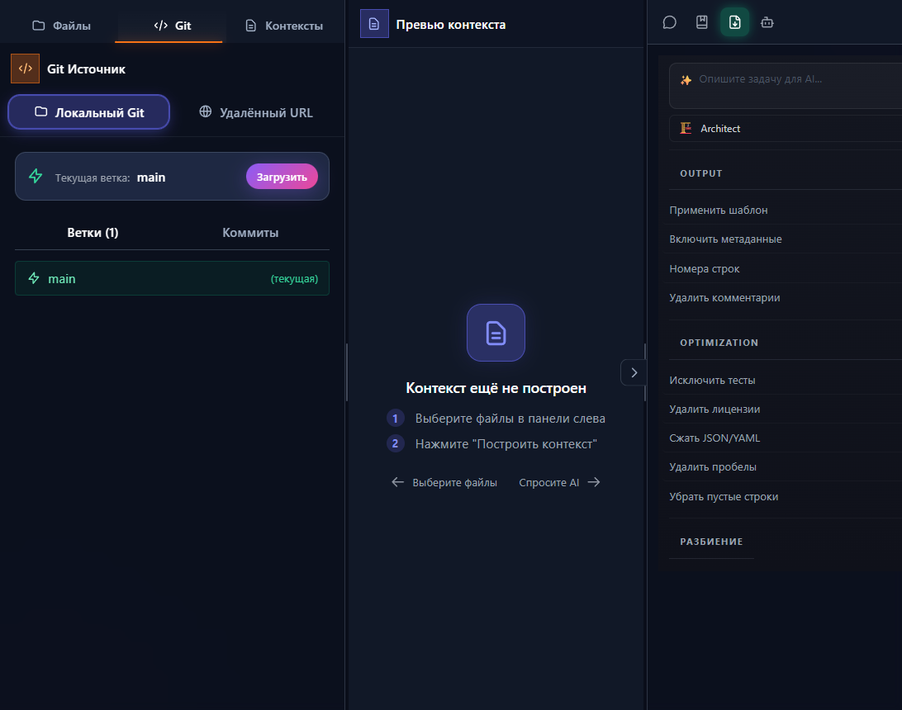
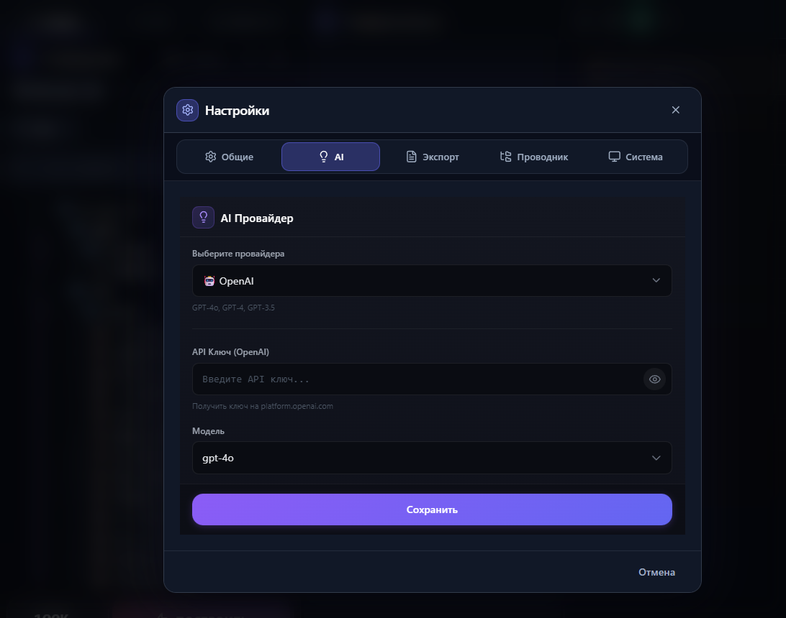

<p align="center">
  
</p>

<h1 align="center">Syntaxia</h1>

<p align="center">
  <strong>AI-Powered Code Context Builder</strong><br>
  Создавайте оптимизированный контекст из кодовой базы для AI-ассистентов
</p>

<p align="center">
  <a href="https://github.com/WhiteBite/Syntaxia/actions/workflows/build.yml">
    
  </a>
  <a href="https://github.com/WhiteBite/Syntaxia/releases/latest">
    
  </a>
  <a href="https://github.com/WhiteBite/Syntaxia/blob/main/LICENSE">
    
  </a>
  
</p>

<p align="center">
  
  
  
  
</p>

<p align="center">
  <a href="#-быстрый-старт">Быстрый старт</a> •
  <a href="#-возможности">Возможности</a> •
  <a href="#-скриншоты">Скриншоты</a> •
  <a href="#-установка">Установка</a> •
  <a href="#-ai-провайдеры">AI Провайдеры</a> •
  <a href="README.md">English</a>
</p>

---

## 🎯 Что такое Syntaxia?

Syntaxia помогает подготовить контекст кода для AI-ассистентов (ChatGPT, Claude, Gemini). Вместо ручного копирования:

| Без Syntaxia | С Syntaxia |
|--------------|------------|
| ❌ Копировать каждый файл вручную | ✅ Выбрать файлы в дереве |
| ❌ Превышать лимит токенов | ✅ Авто-подсчёт и лимиты |
| ❌ Включать лишний код | ✅ AI подсказывает нужные файлы |
| ❌ Копировать комментарии и лицензии | ✅ Умная оптимизация убирает шум |
| ❌ Переключаться между приложениями | ✅ Встроенный AI-чат |

---

## ⚡ Быстрый старт

```bash
# 1. Скачайте релиз для вашей платформы
# https://github.com/WhiteBite/Syntaxia/releases

# 2. Откройте папку проекта

# 3. Выберите файлы → Построить → Скопировать в AI-чат
```

**Готово!** Оптимизированный контекст готов для любого AI-ассистента.

---

## ✨ Возможности

<table>
<tr>
<td width="50%">

### 🗂️ Умный файловый браузер
- Древовидный просмотр с иконками
- Фильтр по типу (Go, TS, Vue и др.)
- Поиск по всем файлам
- Учёт `.gitignore`
- Подсчёт токенов на файл/папку

</td>
<td width="50%">

### 🔀 Git интеграция
- Просмотр локальных репозиториев
- Переключение веток
- История коммитов
- Клонирование с GitHub/GitLab
- Выбор файлов из любого коммита

</td>
</tr>
<tr>
<td width="50%">

### 🤖 AI-функции
- Подсказки контекста
- Встроенный AI-чат
- Множество провайдеров
- Стриминг ответов
- 1M+ токенов контекста (Qwen)

</td>
<td width="50%">

### ⚡ Оптимизация
- Удаление комментариев и лицензий
- Сжатие пустых строк
- Компактификация JSON/YAML
- Исключение тестов
- Разбиение больших контекстов

</td>
</tr>
</table>

---

## 📸 Скриншоты

<details>
<summary><b>🖥️ Основной интерфейс</b> — Файловый браузер с подсчётом токенов</summary>
<p align="center">
  
</p>
</details>

<details>
<summary><b>📝 Превью контекста</b> — Готовый контекст для копирования</summary>
<p align="center">
  
</p>
</details>

<details>
<summary><b>💬 AI Чат</b> — Задавайте вопросы о коде</summary>
<p align="center">
  
</p>
</details>

<details>
<summary><b>🔀 Git панель</b> — Переключение веток и история</summary>
<p align="center">
  
</p>
</details>

<details>
<summary><b>⚙️ Настройки</b> — Конфигурация AI провайдера</summary>
<p align="center">
  
</p>
</details>

---

## 📦 Установка

### Скачать

| Платформа | Скачать | Требования |
|-----------|---------|------------|
| **Windows** | [`SyntaxiaWB.exe`](https://github.com/WhiteBite/Syntaxia/releases/latest) | Windows 10+ |
| **macOS** | [`SyntaxiaWB.app.zip`](https://github.com/WhiteBite/Syntaxia/releases/latest) | macOS 11+ |
| **Linux** | [`SyntaxiaWB`](https://github.com/WhiteBite/Syntaxia/releases/latest) | GTK3, WebKit2GTK |

### Сборка из исходников

```bash
# Требования: Go 1.24+, Node.js 20+, Wails CLI
git clone https://github.com/WhiteBite/Syntaxia.git
cd Syntaxia

# Разработка
./dev.ps1          # Windows
make dev           # Linux/macOS

# Продакшн сборка
./build-windows.ps1
./build-macos.sh
./build-linux.sh
```

---

## 🤖 AI Провайдеры

| Провайдер | Модели | Макс. контекст | Настройка |
|-----------|--------|----------------|-----------|
| **OpenAI** | GPT-4o, GPT-4, GPT-3.5 | 128K | [Получить ключ](https://platform.openai.com/api-keys) |
| **Google Gemini** | Gemini Pro, Flash | 1M | [Получить ключ](https://aistudio.google.com/apikey) |
| **Qwen** | Coder Plus | 1M | [Получить ключ](https://dashscope.console.aliyun.com/) |
| **OpenRouter** | 100+ моделей | Разный | [Получить ключ](https://openrouter.ai/keys) |
| **LocalAI** | Llama, Mistral и др. | Без лимита | Локальный |

---

## ⌨️ Горячие клавиши

| Клавиша | Действие |
|---------|----------|
| `Ctrl+O` | Открыть проект |
| `Ctrl+F` | Поиск файлов |
| `Ctrl+,` | Настройки |
| `Ctrl+C` | Копировать контекст |
| `Ctrl+B` | Построить контекст |

---

## 🛠️ Технологии

| Слой | Технология |
|------|------------|
| **Backend** | Go 1.24, Clean Architecture |
| **Frontend** | Vue 3, TypeScript, Pinia, Tailwind CSS |
| **Desktop** | Wails v2 (Go ↔ JS bridge) |
| **CI/CD** | GitHub Actions |

---

## 🤝 Участие в разработке

Приветствуются контрибьюции! Перед PR:

1. Запустите тесты:
```bash
cd backend && go test ./... && golangci-lint run
cd frontend && npm run build && npm run test:run
```

2. Следуйте [конвенции коммитов](https://www.conventionalcommits.org/)

---

## 📄 Лицензия

[MIT License](LICENSE) — бесплатно для личного и коммерческого использования.

---

<p align="center">
  Сделано с ❤️ <a href="https://github.com/WhiteBite">WhiteBite</a>
</p>

<p align="center">
  <a href="https://github.com/WhiteBite/Syntaxia/stargazers">⭐ Поставьте звезду</a>, если проект полезен!
</p>
