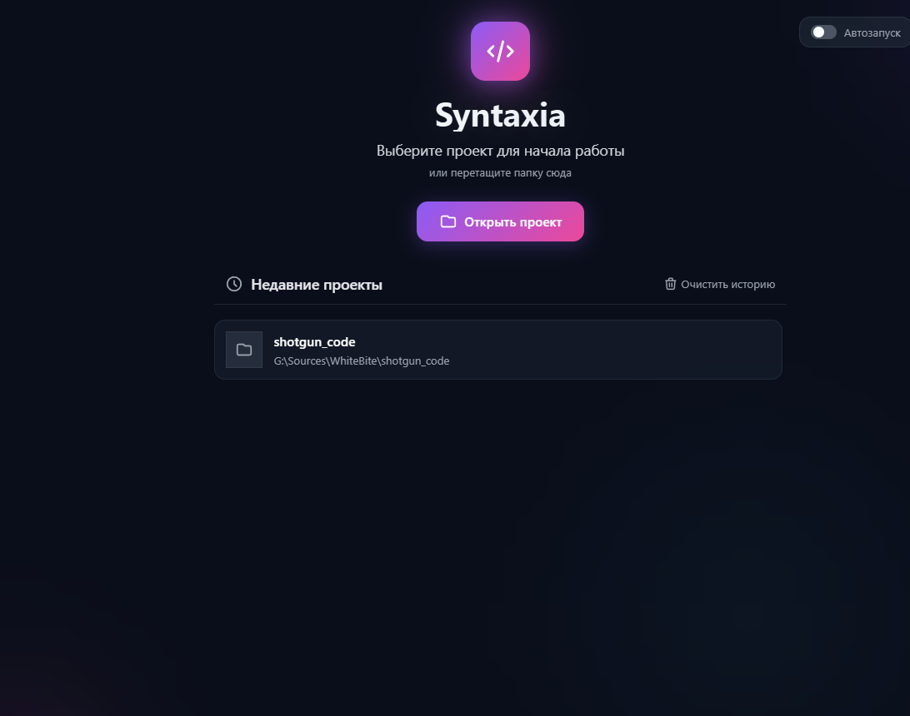

<p align="center">
  
</p>

<h1 align="center">Syntaxia</h1>

<p align="center">
  <strong>AI-Powered Code Context Builder</strong><br>
  Создавайте оптимизированный контекст из кодовой базы для AI-ассистентов
</p>

<p align="center">
  <a href="#возможности">Возможности</a> •
  <a href="#скриншоты">Скриншоты</a> •
  <a href="#установка">Установка</a> •
  <a href="#использование">Использование</a> •
  <a href="#ai-провайдеры">AI Провайдеры</a>
</p>

<p align="center">
  
  
  
  
</p>

---

## Что такое Syntaxia?

Syntaxia помогает подготовить контекст кода для AI-ассистентов (ChatGPT, Claude, Gemini). Вместо ручного копирования файлов:

- 📁 **Сканирует проект** с умной фильтрацией (учитывает .gitignore)
- 🎯 **Выбирает нужные файлы** вручную или с помощью AI
- ⚡ **Оптимизирует вывод** — удаляет комментарии, лицензии, пустые строки
- 📋 **Экспортирует контекст** готовый для вставки в любой AI-чат
- 💬 **Встроенный AI-чат** для работы с кодом напрямую

---

## Возможности

### 🗂️ Умный файловый браузер
- Древовидный просмотр с иконками типов файлов
- Фильтрация по типу (Go, TypeScript, Vue и др.)
- Поиск по всем файлам
- Учёт `.gitignore` и кастомных правил
- Счётчики файлов в папках

### 🔀 Git интеграция
- Просмотр локальных репозиториев
- Переключение между ветками
- История коммитов
- Клонирование удалённых репозиториев (GitHub, GitLab)
- Выбор файлов из любой ветки/коммита

### 🤖 AI-функции
- **Подсказки контекста**: AI рекомендует релевантные файлы
- **Встроенный чат**: задавайте вопросы о коде напрямую
- **Множество провайдеров**: OpenAI, Gemini, Qwen, OpenRouter, LocalAI

### ⚡ Оптимизация контекста
- Удаление комментариев и лицензий
- Сжатие пустых строк
- Компактификация JSON/YAML
- Исключение тестовых файлов
- Подсчёт токенов с лимитами

### 📤 Экспорт
- Копирование в буфер обмена
- Экспорт в файл (TXT, MD, JSON)
- Разбиение больших контекстов на части
- Применение шаблонов
- Включение метаданных файлов

### 🎨 Современный UI
- Тёмная тема с glow-эффектами
- Изменяемые панели
- Горячие клавиши
- Мультиязычность (English, Русский)
- Интеграция в контекстное меню ОС

---

## Скриншоты

### Экран приветствия
<p align="center">
  
</p>

### Основной интерфейс
<p align="center">
  
</p>

### AI Чат
<p align="center">
  
</p>

### Git интеграция
<p align="center">
  
</p>

### Настройки
<p align="center">
  
</p>

---

## Установка

### Скачать
Загрузите последний релиз для вашей платформы:
- **Windows**: `SyntaxiaWB.exe`
- **macOS**: `SyntaxiaWB.app.zip`
- **Linux**: `SyntaxiaWB`

### Сборка из исходников

```bash
# Требования: Go 1.24+, Node.js 20+, Wails CLI

# Клонирование
git clone https://github.com/WhiteBite/Syntaxia.git
cd Syntaxia

# Разработка
./dev.ps1          # Windows
make dev           # Linux/macOS

# Сборка
./build-windows.ps1
./build-macos.sh
./build-linux.sh
```

---

## Использование

1. **Откройте проект**: нажмите "Открыть проект" или перетащите папку
2. **Выберите файлы**: отметьте в дереве или используйте AI-подсказки
3. **Настройте**: установите лимит токенов, включите оптимизации
4. **Постройте контекст**: нажмите "Построить"
5. **Экспортируйте**: скопируйте в буфер или сохраните в файл

### Горячие клавиши
| Клавиша | Действие |
|---------|----------|
| `Ctrl+O` | Открыть проект |
| `Ctrl+F` | Поиск файлов |
| `Ctrl+,` | Настройки |
| `Ctrl+C` | Копировать контекст |

---

## AI Провайдеры

| Провайдер | Модели | Особенности |
|-----------|--------|-------------|
| **OpenAI** | GPT-4o, GPT-4, GPT-3.5 | Чат, Стриминг |
| **Google Gemini** | Gemini Pro, Flash | Большой контекст |
| **Qwen** | Coder Plus (1M токенов) | Огромное окно контекста |
| **OpenRouter** | 100+ моделей | Агрегатор моделей |
| **LocalAI** | Llama, Mistral и др. | Локальный, Приватный |

---

## Технологии

| Слой | Технология |
|------|------------|
| **Backend** | Go 1.24, Clean Architecture |
| **Frontend** | Vue 3, TypeScript, Pinia, Tailwind CSS |
| **Desktop** | Wails v2 (Go ↔ JS bridge) |
| **CI/CD** | GitHub Actions, Кросс-платформенная сборка |

---

## Лицензия

MIT License

---

<p align="center">
  Сделано с ❤️ <a href="https://github.com/WhiteBite">WhiteBite</a>
</p>
